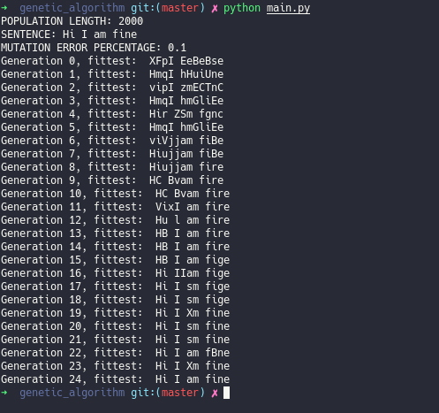

# Procedural Genetic Algorithm

## How it works

A genetic algorithm is an algorithm inspired by the process of Darwin's natural selection. You can find more [here](https://www.whitman.edu/Documents/Academics/Mathematics/2014/carrjk.pdf).

This particular algorithm follows a procedural style, it does some simply and well defined steps:

- It creates a population with a fixed length of random strings (chromosomes).
- It calculates how each random string is equal to our sentence/word.
- It changes the order of every chromosome in our population by their fitness points.
- It makes a crossover operation among fittest chromosomes.
- It adds the new chromosomes (eventually mutated) to a new population.
- It kills the rest of the chromosomes.
- It spawns the same number of random chromosome killed before.
- (It prints the number of the current generation along with the fittest chromosome in the population until it's perfectly equal to our sentence/word).
- Repeat.

## Supported chars

In `util.py` you can find the `letters` variable that contains all ASCII letters (they are our genes) plus a space. Our algorithm will pick random chars from that list in order to make random population's members (chromosomes).
From this variable depends the variety 
of chromosomes created.

## Screenshot

